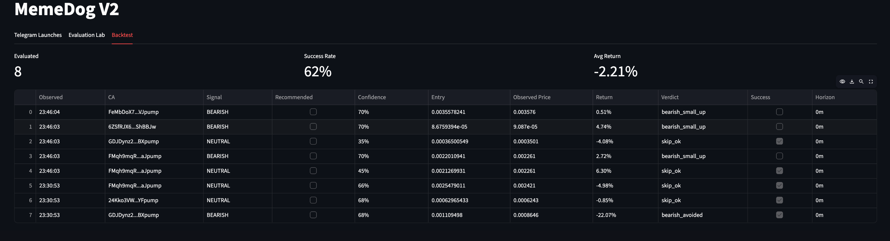
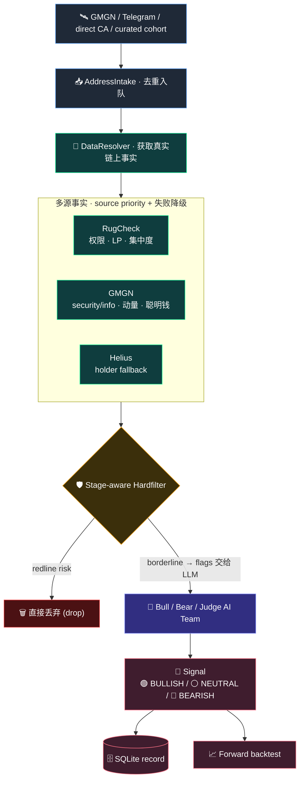
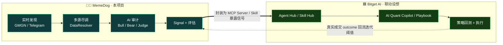

<div align="center">

# 🐕‍🦺 MemeDog Radar

**MemeDog Radar 是一个面向 Solana meme coin 的实时监控与 AI 评估系统。**

<br>


<br>

[**思路**](#-1-思路为什么做-memedog) · [**完成度**](#-2-完成度已经做了什么) · [**AI Trading**](#-3-对-ai-trading-的看法) · [**Bitget 联动**](#-4-赛道契合与-bitget-ai-联动设想) · [**Quick Start**](#-quick-start) · [**Live Eval**](#-run-live-evaluations) · [**Backtest**](#-backtest--outcome-scoring) · [**Dashboard**](#-dashboard)

</div>

---

我们的目标不是替用户直接下单，而是做一只“侦查犬”：在 Solana 上持续嗅探新出现、刚开始有交易动量的 meme coin，用链上数据、GMGN 早期信号和多角色 LLM 审计来判断它更像机会，还是更像陷阱。当前主要实现都在 [`src/memedogV2/`](src/memedogV2/)。

> ⚠️ **免责声明**：本项目仅用于研究、演示和 paper evaluation。不连接真实钱包，不执行真实交易，不构成投资建议。

---

## 📑 目录 / Contents

1. [📸 Demo Screenshots](#-demo-screenshots) —— 三个 dashboard 实拍
2. [🧭 思路:为什么做 MemeDog](#-1-思路为什么做-memedog) —— 痛点、stage-aware funnel 架构图
3. [🚀 完成度:已经做了什么](#-2-完成度已经做了什么) —— 已完成 / 问题与解决 / 尚未完成 / 下一步 / 技术栈
4. [💡 对 AI Trading 的看法](#-3-对-ai-trading-的看法) —— Agentic Trading 的判断
5. [🔌 赛道契合与 Bitget AI 联动](#-4-赛道契合与-bitget-ai-联动设想) —— AI Infra 赛道映射 + 联动设想
6. [⚡ Quick Start](#-quick-start) —— 安装、配置、跑测试
7. [🔭 Run Live Evaluations](#-run-live-evaluations) —— GMGN trending / signal / trenches / cohort
8. [📊 Backtest / Outcome Scoring](#-backtest--outcome-scoring) —— 信号有用性评分
9. [🖥️ Dashboard](#-dashboard) —— 启动看板与实时监听
10. [🗂️ Project Map](#-project-map) —— 代码结构

---

## 📸 Demo Screenshots

<div align="center">

<br>
<sub><b>Telegram Launches</b> · 实时新池监听</sub>

<br><br>

<br>
<sub><b>Evaluation Lab</b> · cohort 评估</sub>

<br><br>

<br>
<sub><b>Backtest</b> · outcome scoring</sub>

</div>

---

## 🧭 1. 思路：为什么做 MemeDog

Solana meme coin 的交易机会非常短，噪音也非常大。一个真实交易者或交易 Agent 在处理新币时会遇到几个具体痛点：

- 新币数量太多，人工不可能逐个看合约、LP、持仓、买卖盘和聪明钱。
- 绝大多数新币在几分钟内就暴露风险，例如 LP 未锁、top holder 过度集中、bundler/sniper 过高、虚假买盘、流动性不足。
- 如果直接让 LLM 看所有新币，成本高、延迟大，而且 LLM 容易被叙事带偏。
- 如果只靠硬规则，又会错过一些“早期但尚未成熟”的候选，因为新币在不同生命周期里的风险含义不同。

MemeDog 的核心解法是一条 stage-aware funnel：



这里最重要的设计是：**Hardfilter 不负责判断 bullish，只负责判断“是否值得花 LLM 成本审计”。**

真正的买入/不买入判断交给 LLM Judge。Judge 会同时看到：

- 安全数据：mint/freeze 权限、LP 状态、honeypot。
- 持仓集中度：top10、max wallet、creator/dev 持仓。
- 市场结构：sniper、fresh wallet、bundler。
- 动量数据：5m volume、buys/sells、liquidity、market cap。
- 早期质量信号：smart money、KOL、dev 历史、historical ATH。
- hardfilter flags：例如 top10 略高、buy/sell 边缘、sniper 略高。
- token stage：`new_creation`、`near_completion`、`completed`、`trending`、`signal` 等。

因此系统不会把“通过硬过滤”误解成“值得买”，而是把它当作进入 AI 审计的资格。LLM 最终可以输出：

| Signal | 含义 |
|:------:|------|
| 🟢 `BULLISH` | 值得关注或推荐，且风险/回报结构足够好。 |
| ⚪ `NEUTRAL` | 有机会但不够干净，适合 watchlist。 |
| 🔴 `BEARISH` | 更像风险盘、分发盘或已过热，不建议进入。 |

---

## 🚀 2. 完成度：已经做了什么

### ✅ 已完成

当前 V2 已经具备完整的实时评估闭环：

- `gmgn-cli` 市场候选接入：
  - `market trending`
  - `market signal`
  - `market trenches`
- Telegram GMGN 新池监听入口，与 curated evaluation 分离。
- 直接输入 CA 或 candidate file 的 cohort 评估模式。
- 多源事实解析：
  - RugCheck：权限、LP、集中度。
  - GMGN：security/info、动量、聪明钱、KOL、dev 历史。
  - Helius：holder fallback。
- stage-aware hardfilter：
  - redline 直接 drop。
  - soft risk 进入 `HARD_FILTER_FLAGS`。
  - 新币阶段不会因为 pending LP/admin 状态被过早误杀。
- Bull / Bear / Judge 三角色 LLM 审计：
  - Bull 负责提出最强正面论点。
  - Bear 负责提出最强风险论点。
  - Judge 做最终 go/no-go verdict。
- DeepSeek / Codex / Fake backend：
  - 推荐 live evaluation 使用 DeepSeek。
  - `DEEPSEEK_API_KEY` 可从 `.env` 自动加载。
- SQLite 持久化：
  - scanner intake
  - V2 audit runs
  - backtest outcomes
- forward backtest：
  - run 发生时记录 entry price。
  - 到达 horizon 后重新取当前价格。
  - 判断 LLM 的 `BULLISH / BEARISH / NEUTRAL` 是否有用。
- Streamlit dashboard：
  - `Telegram Launches`：实时新池监听。
  - `Evaluation Lab`：famous memes、bad memes、GMGN trending/signal 等 cohort。
  - `Backtest`：展示成功率、平均回报、每条 signal 的 outcome。

### 🛠️ 开发中遇到的问题与解决

第一类问题是新币数据天然不稳定。很多刚创建的 meme coin 在 RugCheck、GMGN、Helius 中会出现字段缺失、口径不一致或短时间内剧烈变化。解决方式是做 `DataResolver`，按字段维护 source priority，并允许单个来源失败后降级，不让整条 pipeline 崩掉。

第二类问题是 hardfilter 太严格会导致几乎没有新币进入 LLM，太宽又会浪费模型调用。我们把 hardfilter 拆成 redline 和 soft flags：真正危险的条件继续 drop，边缘风险则交给 Judge 判断。

第三类问题是 Telegram 新币流和实验性 backtest cohort 混在一起会让 demo 变乱。现在 dashboard 已经把它们拆成独立 tab：实时监听归实时监听，curated cohort 和 backtest 归 Evaluation Lab / Backtest。

第四类问题是 “famous meme coin” 与 “new launch meme coin” 的评估口径不同。BONK/WIF/POPCAT 这类成熟 token 不是同一种生命周期，部分 GMGN/RugCheck 字段也不一定适配新币 hardfilter。当前系统可以跑它们作为 sanity benchmark，但后续应该为 mature meme 建立单独 profile。

### 🚧 尚未完成

- 尚未接真实钱包和真实交易执行。
- 尚未做完整历史 OHLCV 回放式 backtest；当前是 forward-looking outcome scoring。
- 尚未把 famous memes、bad memes 做成内置 dataset。
- 尚未把不同 token stage 的阈值完全参数化。
- 尚未接入 Bitget 官方回测 Playbook 或交易执行工具。

### 🗺️ 下一步计划

- 增加 `profile=new_launch | migrated | mature_meme | bad_meme`，让 hardfilter 和 Judge 使用不同阈值。
- 增加 curated datasets：
  - famous winners：BONK、WIF、POPCAT 等。
  - bad/rugged examples：历史失败 meme coin。
  - fresh GMGN trenches samples。
- 增加多 horizon backtest：
  - 15m
  - 60m
  - 4h
  - 24h
- 在 dashboard 增加 cohort-level confusion matrix：
  - bullish hit
  - bullish loss
  - bearish avoided
  - missed runner
- 探索接入 Bitget Agent Hub / Playbook / MCP Server / Skill Hub 作为更完整的 AI quant copilot 和 backtest layer。

### 🧱 技术栈与外部 API


Bitget 相关说明：当前代码主要参考 Bitget Hackathon 中 “AI Quant Copilot / Playbook” 的产品方向和 demo 组织方式；项目暂未直接依赖 Bitget 官方回测 Playbook。如果后续接入 Bitget Agent Hub、MCP Server 或 Skill Hub，应在本节补充具体调用方式。

---

## 💡 3. 对 AI Trading 的看法

我认为 Agentic Trading 的关键不是让 AI “猜涨跌”，而是让 AI 参与到交易基础设施中最容易出错的部分：

- 自动收集多源事实。
- 把噪音候选压缩成少量可审计机会。
- 对风险进行结构化解释。
- 把每一次判断保存下来，再用 backtest/outcome scoring 反向评估。

Meme coin 领域尤其适合这种 agentic workflow，因为它既高频、又非结构化、还充满叙事噪音。一个好的 AI trading agent 不应该只是说 “buy” 或 “sell”，而应该像研究员一样说明：

- 为什么这个 token 值得看？
- 哪些风险是硬伤？
- 哪些风险只是当前阶段的正常不确定性？
- 如果错了，错在哪里？
- 这个策略在一批 token 上长期是否有效？

Bitget 的 AI Quant Copilot / Playbook 方向很适合补足这条链路的后半段：把自然语言策略、数据工具、回测和执行连接起来。对 MemeDog 来说，最有价值的下一步不是更激进地下单，而是把 “LLM 判断 -> 实际 outcome -> 策略调整” 变成可视化、可复盘、可迭代的闭环。

---

## 🔌 4. 赛道契合与 Bitget AI 联动设想

> 🎯 **参赛赛道：AI Infra · 交易 Infra** —— 构建让 Agent 跑得更好、或让交易者用起来更高效的基础设施(给 Agent 的工具/框架、给交易者的产品如监控面板/可视化、策略测评与评估系统)。

**MemeDog 的三块能力,正好一一对应赛道的三类范围:**

| 赛道范围 | MemeDog 已落地的对应实现 |
|---|---|
| 🧰 给 Agent 用的工具 / 框架 | 多源 `DataResolver` + 确定性 harness + Bull/Bear/Judge 审计编排 —— 一个“输入 CA → 输出结构化尽调 + 信号”的可复用链上研判组件 |
| 📊 给交易者用的产品(监控 / 可视化) | Streamlit dashboard：`Telegram Launches` 实时监听 · `Evaluation Lab` cohort 评估 · `Backtest` 成功率/回报可视化 |
| 🧪 策略测评与评估系统 | forward backtest + outcome scoring —— 用真实 outcome 反向验证 `BULLISH / BEARISH / NEUTRAL` 是否有用 |

**未来与 Bitget AI 的联动 —— 火花在哪:**

MemeDog 负责“发现 → 研判 → 信号”的前半段,天然可以接上 Bitget AI“策略 → 回测 → 执行”的后半段,拼成一条完整的 agentic trading 闭环:



- **🔌 作为 Bitget Agent Hub 的一个 Skill / MCP Server** —— 把“输入 CA → 返回链上尽调 + 信号”封成标准 MCP Server,任何 Bitget AI Agent 一行接入“Solana meme 链上体检”能力。
- **🧠 与 AI Quant Copilot / Playbook 互补** —— MemeDog 出信号,Playbook 把自然语言策略 → 回测 → 执行,补上“发现 → 研判”之后的“回测 → 执行”。
- **🔁 outcome 数据回流** —— MemeDog 的 backtest / outcome scoring 可作为 Playbook 评估层的数据源,用真实成交结果反向迭代 hardfilter 阈值与 Judge 偏好。
- **🌐 多链平移** —— 当前聚焦 Solana,resolver 的多源架构可平移到 Bitget 生态与其他链。

---

## ⚡ Quick Start

Install dependencies:

```bash
pip install -e ".[dev]"
cp .env.example .env
```

Set DeepSeek key in `.env`:

```bash
DEEPSEEK_API_KEY=...
```

Install and configure GMGN CLI:

```bash
npm install -g gmgn-cli
# gmgn-cli reads its API key from ~/.config/gmgn/.env
```

Configure GMGN Telegram pool alerts:

1. Join or subscribe your Telegram account to the GMGN Solana New Pool Alert group/channel.
2. Create a Telegram API app at `https://my.telegram.org` under `API development tools`.
3. Fill these values in `.env`:

```bash
TELEGRAM_API_ID=...
TELEGRAM_API_HASH=...
TELEGRAM_SESSION=memedog_gmgn
```

The listener reads GMGN pool-alert messages through your Telegram user session. It does not require a separate outbound alert bot.

The default GMGN alert source is configured in [`src/memedog/config/thresholds.yaml`](src/memedog/config/thresholds.yaml):

```yaml
discovery:
  gmgn_chats:
    - "2122751413"  # Solana New Pool Alert - GMGN
```

If you use a different GMGN alert group/channel, replace that value with the group username or `-100...` channel id.

Run V2 tests:

```bash
.venv/bin/python -m pytest tests/memedogV2
```

---

## 🔭 Run Live Evaluations

Evaluate current GMGN trending memes:

```bash
.venv/bin/python -m memedogV2 \
  --gmgn-market trending \
  --chain sol \
  --interval 5m \
  --order-by volume \
  --direction desc \
  --filter renounced \
  --filter not_wash_trading \
  --limit 5 \
  --backend deepseek \
  --db memedog.db
```

Evaluate GMGN early-signal candidates:

```bash
.venv/bin/python -m memedogV2 \
  --gmgn-market signal \
  --chain sol \
  --signal-type 2 \
  --signal-type 3 \
  --signal-type 4 \
  --limit 5 \
  --backend deepseek \
  --db memedog.db
```

Evaluate GMGN trenches candidates:

```bash
.venv/bin/python -m memedogV2 \
  --gmgn-market trenches \
  --chain sol \
  --trenches-type new_creation \
  --trenches-type near_completion \
  --trenches-type completed \
  --filter-preset safe \
  --sort-by volume_1h \
  --direction desc \
  --limit 5 \
  --backend deepseek \
  --db memedog.db
```

Evaluate a curated cohort:

```bash
.venv/bin/python -m memedogV2 \
  --candidate-file famous.txt \
  --cohort famous-memes \
  --backend deepseek \
  --db memedog.db
```

```bash
.venv/bin/python -m memedogV2 \
  --candidate-file badmemes.txt \
  --cohort bad-memes \
  --backend deepseek \
  --db memedog.db
```

---

## 📊 Backtest / Outcome Scoring

Score runs after a horizon:

```bash
.venv/bin/python -m memedogV2 --backtest-db memedog.db --horizon-min 60 --limit 50
```

For demo-only immediate scoring:

```bash
.venv/bin/python -m memedogV2 --backtest-db memedog.db --horizon-min 0 --limit 50
```

Outcome logic:

- `BULLISH + recommended=true` needs to clear the win threshold.
- `BEARISH` or `NEUTRAL` is useful if it avoided a runner.
- Missed runners are counted as strategy failures.

---

## 🖥️ Dashboard

Start the V2 dashboard only, using records already stored in `memedog.db`:

```bash
MEMEDOG_DB=memedog.db .venv/bin/python -m streamlit run dashboard/app.py --server.port 8502 --server.headless true
```

Or start the live GMGN Telegram pool-alert listener plus dashboard:

```bash
.venv/bin/python -m memedogV2.serve --backend deepseek --db memedog.db --port 8502
```

Open:

```text
http://localhost:8502
```

Dashboard tabs:

- `Telegram Launches`: live GMGN Telegram/new-pool listener.
- `Evaluation Lab`: curated cohorts and GMGN market batches.
- `Backtest`: persisted outcome scoring and strategy usefulness.

---

## 🗂️ Project Map

```text
src/memedogV2/
  __main__.py                 CLI entrypoint
  candidates.py               GMGN market candidate normalization
  scanner.py                  GMGN Telegram launch-alert parser
  intake.py                   deduped address queue
  sources/                    RugCheck, GMGN, Helius adapters
  hardfilter/                 stage-aware redline + soft-flag rules
  audit/prompts.py            Bull / Bear / Judge prompts
  harness/runner.py           deterministic production audit path
  store.py                    SQLite persistence and backtest rows
  backtest.py                 forward outcome scoring
```

Deprecated V1 code remains under `src/memedog/`, but current development and demo flow are centered on `src/memedogV2/`.
